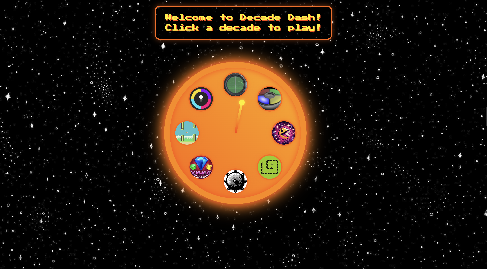

# 🎮 DecadeDash: A Journey Through Gaming History

**DecadeDash** is a retro-inspired web-based game that takes players on a time-traveling adventure through the history of video games — one iconic game per decade from the 1950s to the 2020s. The project was created for a hackathon with the theme **"Travelling Through Time"**.

---

## 🕰️ Explore 8 Decades of Gaming

Each decade unlocks a mini-game that defined an era:

| Decade | Game             | Description                              |
|--------|------------------|------------------------------------------|
| 1950s  | 🎾 *Tennis for Two*  | Early physics-based game simulation      |
| 1960s  | 🧠 *Simon Says*       | Test your memory with repeating patterns |
| 1970s  | 🐍 *Snake*            | The classic growing snake game          |
| 1980s  | 👻 *Pac-Man*          | Navigate the maze and dodge ghosts      |
| 1990s  | 💣 *Minesweeper*      | Reveal the grid without hitting bombs   |
| 2000s  | 💎 *Bejeweled*        | Match gems and rack up points           |
| 2010s  | 🐦 *Flappy Bird*      | Tap to stay alive                       |
| 2020s  | 🎨 *Color Switch*     | Tap through color-matching obstacles    |

All games are accessed through a clickable **decade clock** interface, designed to visually represent a journey through time.

---

## 🧠 Why I Built This

As a Computer Science student and a casual video game enthusiast, I wanted to merge my passion for creativity, games, and interactivity. This hackathon was the perfect opportunity to celebrate the evolution of games and explore web development. *DecadeDash* showcases how far games have come — all within the browser.

---

## 🚀 Features

- 🕹️ 8 fully playable mini-games  
- ⏱️ Interactive decade clock to navigate across time  
- 💾 Save/Resume support for selected games  
- 📱 Responsive design 

---

## 🌐 Built With

- **HTML** — Page structure and layout  
- **CSS** — Styling and retro-themed UI  
- **JavaScript** — Game logic and interactivity  
- **Git** — For version control

---

## 📸 Demo

🎥 *Coming soon!*  
